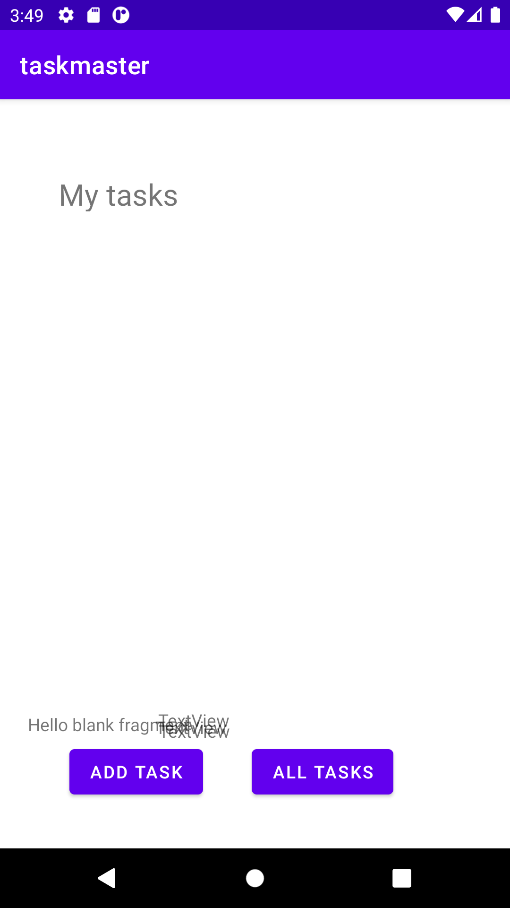
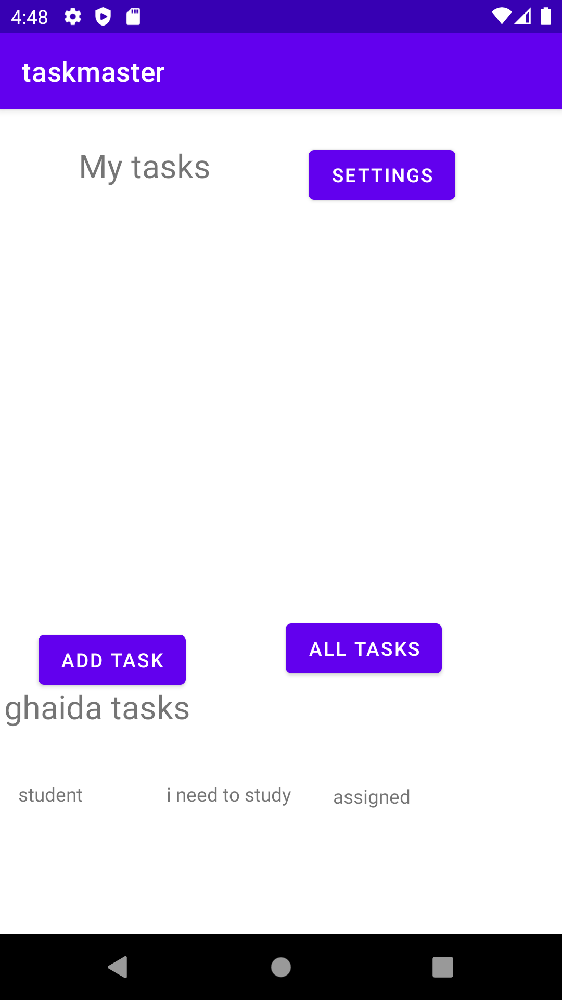
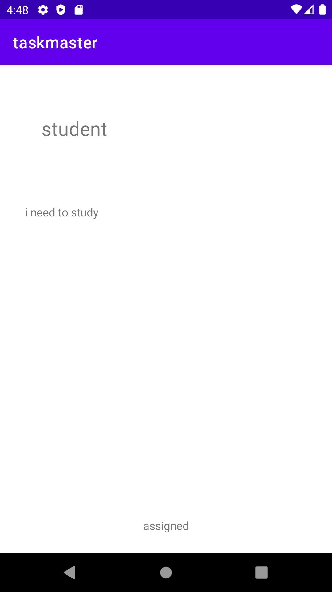
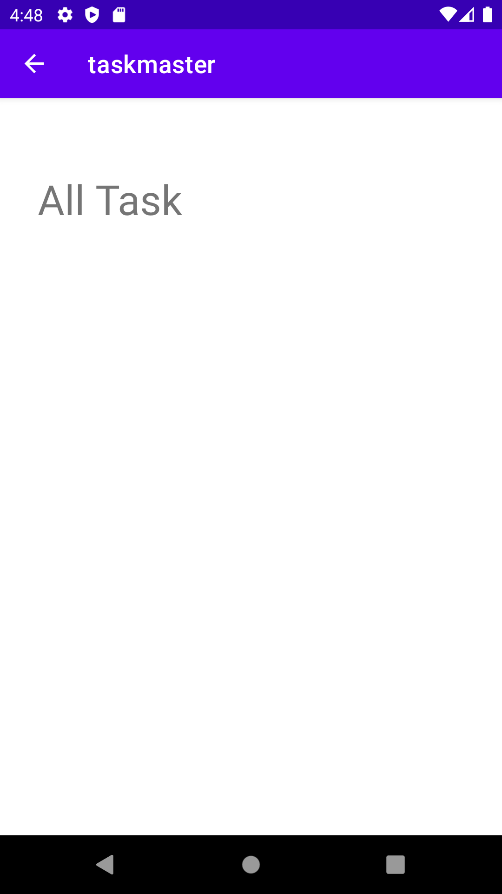
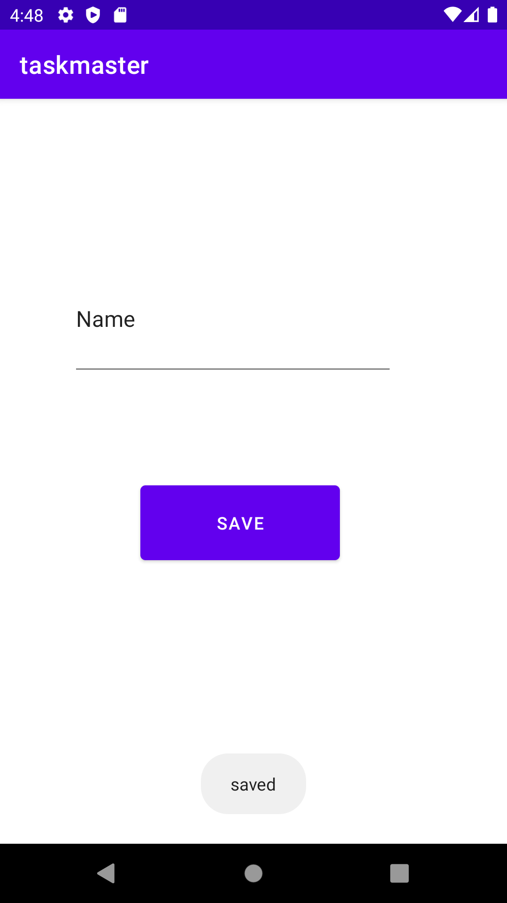
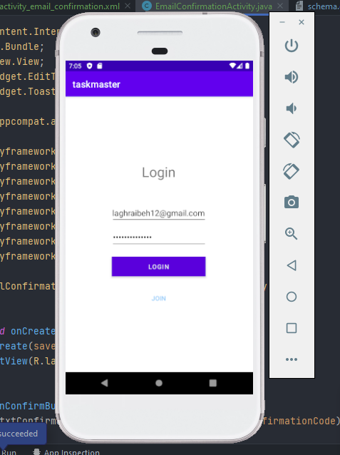
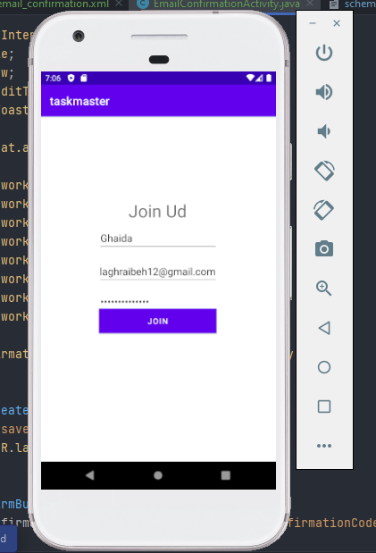
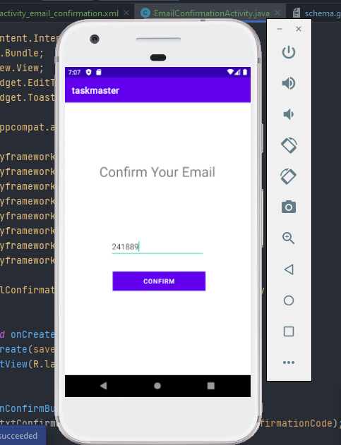
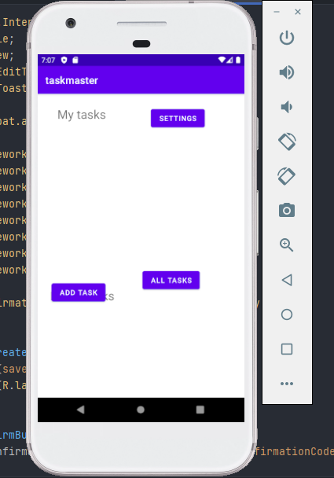
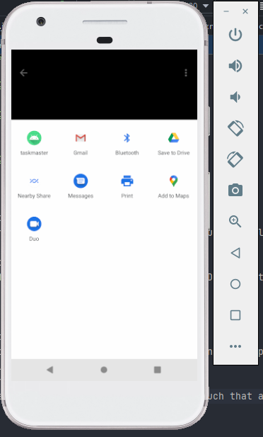

# taskmaster

## Day 1

* added the outlays and configure its classes.
* added some styles.

## Day 2

* added three tasks with separate details pages.
* added a settings page that allows users to edit the name

## Day 3

* We refactored our hard coded data into a recycled view loop

## Day 4

* We utilized the room db and rendered the data from it into the mainpage

## Cognito

  ### Here We can see every user thay have an account

# Lab 37: S3
In this lab, the app will allow users to upload files related to tasks.

## Add Task Activity
Modify the Add Task form to include UPLOAD FILE button to allow the user to upload a file.

# Lab: 41 - Intent Filters

Is to allow users to share a photo from another app and open TaskMaster, ready to upload that image as part of a new task.
Feature Tasks
- Adding a Task from Another Application
Add an intent filter to the application such that a user can hit the share button on an image in another application, choose TaskMaster as the app to share that image with, and be taken directly to the Add a Task activity with that image pre-selected.

